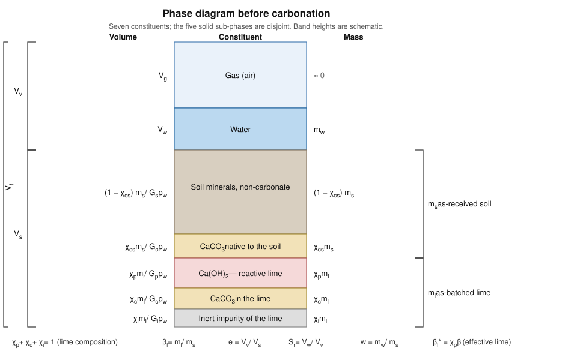
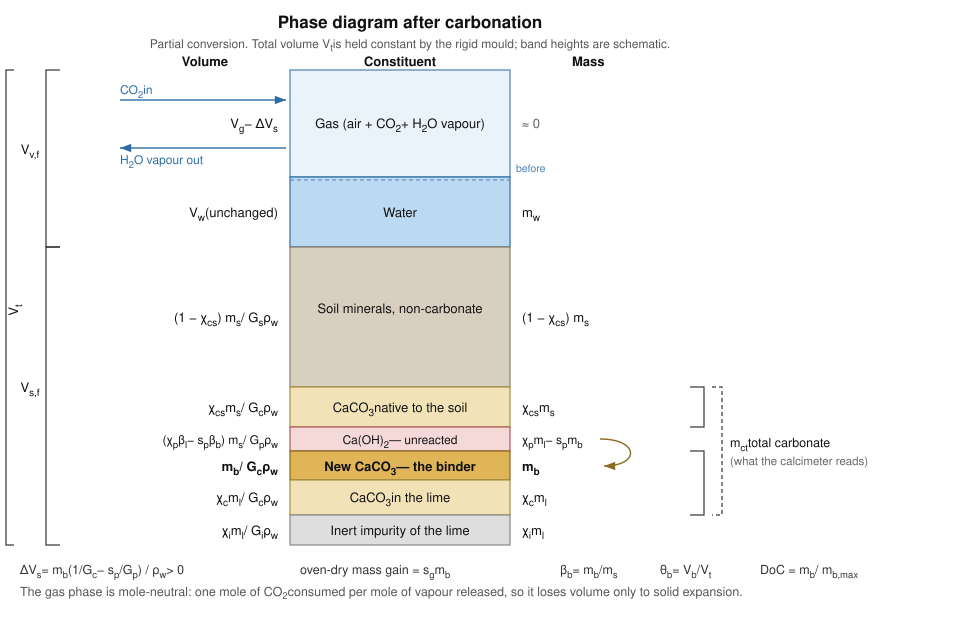

# Phase-diagram relations for carbonation experiments

**Companion to:** *Numerical modeling of coupled multi-gas transport and reaction kinetics to simulate carbonation of non-plastic soils mixed with hydrated lime* (`Olf_paper/Elsevier_CG/Numerical_Carbonation_Espinosa_CG.tex`)

**Scope:** mass and volume relations for specimen preparation and for reduction of post-test measurements; definition of the degree of carbonation, binder content and lime-to-water ratio

**Reference implementation:** `verify_spreadsheets.py` in this folder reproduces every number quoted here and audits the lab workbooks against these relations

**Prepared:** 2026-09-15

This file supplies the phase relations that the experimental programme has been using implicitly. The existing workbooks encode a version of them cell by cell, without a written derivation, and the resulting degree of carbonation counts carbonate that was present before the test while ignoring the purity of the lime. Sections P1 to P4 set up the phase diagram; P5 to P8 give the reduction formulas for the measurements actually taken in the laboratory; P9 treats the lime-to-water ratio; P10 works a real specimen; P11 lists what remains open.

---

## P1 · The partition, and why the obvious sets overlap

### P1.1 The difficulty

Listing the constituents of a lime-treated specimen as *gas, water, soil solids, lime solids, impurities of the lime, and initial calcium carbonate* does not produce a phase diagram, because the last four sets intersect. Calcium carbonate is present both as a natural component of the soil and as a partly carbonated fraction of the hydrated lime, so "initial CaCO₃" cuts across both "soil solids" and "lime solids". The inert fraction of the lime is a subset of "lime solids", not a sixth constituent beside it. A phase diagram needs sets that are disjoint and exhaustive, so that volumes and masses add.

### P1.2 The partition adopted

Two masses are measured at batching and everything else is expressed through them: $m_s$, the dry mass of **as-received soil**, and $m_l$, the dry mass of **as-batched hydrated lime**. Neither is idealised: the soil carries its natural carbonate, and the lime carries whatever it carries.

The composition of each is then given by mass fractions. For the lime,

$$\chi_p + \chi_c + \chi_i = 1$$

where $\chi_p$ is the fraction that is portlandite, $\text{Ca(OH)}_2$, and therefore reactive; $\chi_c$ is the fraction already carbonated to $\text{CaCO}_3$; and $\chi_i$ is everything else, taken as inert. For the soil, $\chi_{cs}$ is the mass fraction that is $\text{CaCO}_3$ and $1-\chi_{cs}$ is the remaining mineral skeleton.

This yields seven disjoint constituents before the reaction, five of which are solid:

| # | Constituent | Mass | Volume |
|---|---|---|---|
| 1 | Gas | $\approx 0$ | $V_g$ |
| 2 | Water | $m_w$ | $V_w$ |
| 3 | Soil minerals, non-carbonate | $(1-\chi_{cs})\,m_s$ | $(1-\chi_{cs})\,m_s / G_s\rho_w$ |
| 4 | $\text{CaCO}_3$ native to the soil | $\chi_{cs}\,m_s$ | $\chi_{cs}\,m_s / G_c\rho_w$ |
| 5 | $\text{Ca(OH)}_2$, reactive lime | $\chi_p\,m_l$ | $\chi_p\,m_l / G_p\rho_w$ |
| 6 | $\text{CaCO}_3$ in the lime | $\chi_c\,m_l$ | $\chi_c\,m_l / G_c\rho_w$ |
| 7 | Inert impurity of the lime | $\chi_i\,m_l$ | $\chi_i\,m_l / G_i\rho_w$ |

Constituents 4 and 6 are the same mineral from different sources. They are kept apart because the reduction in P5 needs to know how much carbonate each source contributed, and because only constituent 5 can react. After carbonation an eighth appears, the new $\text{CaCO}_3$ of mass $m_b$, and constituent 5 shrinks to pay for it.

### P1.3 Notation

Two rules are adopted throughout, and they resolve the collisions catalogued in P11.2: **every $\beta$ is a mass ratio, and every $\theta$ is a volume fraction**. The symbols $t$ and $T$ are reserved for time and temperature, so the water-film thickness of P9 is written $\delta_w$.

| Symbol | Meaning | Units |
|---|---|---|
| $m_s$, $m_l$, $m_w$ | dry mass of as-received soil, as-batched lime, and water | g |
| $m_b$ | mass of **new** $\text{CaCO}_3$ formed by the reaction | g |
| $m_{ct}$ | **total** $\text{CaCO}_3$ present, as the calcimeter reads it | g |
| $m_d$ | oven-dry mass of the sub-sample being digested | g |
| $\chi_p,\ \chi_c,\ \chi_i$ | portlandite, carbonate and inert fractions of the lime | – |
| $\chi_{cs}$ | carbonate fraction of the as-received soil | – |
| $\beta_l = m_l/m_s$ | lime content, as batched | – |
| $\beta_l^{*} = \chi_p\beta_l$ | **effective** lime content, the part that can react | – |
| $\beta_b = m_b/m_s$ | binder content, mass basis | – |
| $\theta_b = V_b/V_t$ | binder content, volume basis | – |
| $\theta_l,\ \theta_w,\ \theta_g$ | volumetric lime, water and gas content | – |
| $w = m_w/m_s$ | gravimetric water content, **on dry soil** | – |
| $e,\ n,\ S_r$ | void ratio, porosity, degree of saturation | – |
| $G_s,\ G_p,\ G_c,\ G_i$ | specific gravity of soil minerals, portlandite, calcite, lime inert | – |
| $s_p,\ s_c,\ s_v,\ s_g$ | stoichiometric mass ratios of P3 | – |
| $\delta_w$ | water-film thickness | m |
| $V_t,\ V_s,\ V_v$ | total, solid and void volume | cm³ |

The base of $w$ matters. Here $w$, like $\beta_l$ and $\beta_b$, is referred to the dry **soil** mass, which is the convention of the manuscript, of `Carbonation_derivations.md` D3.1 and D11.4, and of the per-kilogram-of-dry-soil weighting used there. The workbooks refer $w$ to the **total** dry mass instead, which makes their $w$ smaller by the factor $1+\beta_l$; see P11.1.

### P1.4 Correspondence with the manuscript and the solver

| Here | CG manuscript | `manuscript1.tex` | ADSIM (`src`) |
|---|---|---|---|
| $\beta_l$ | $\beta_l$ | $\beta_L$ | `lime_content` |
| $\beta_l^{*} = \chi_p\beta_l$ | – | – | – (no purity parameter exists) |
| $\beta_b$ | – | $\beta_B$ | – |
| $\theta_b$ | $\beta_b$ | $\theta_B$ | `binder_content` |
| $m_{b,\max}$ | – | $\beta_{B,max}\,m_s$ | `Caco3_max` $\times\,M_{\text{CaCO}_3}$ |
| unreacted lime | $A_s$ | $\beta_{LF}$ | `C_lime` |
| shielded lime | $A_r$ | – | `C_lime_residual` |
| new carbonate | $B_s$ | $\beta_B\,m_s$ | `C_caco3` |

The molar concentrations $A_s$, $A_r$ and $B_s$ of the manuscript are per unit **total** volume, so they connect to the mass quantities here through $A_s = \chi_p\beta_l\,m_s/(M_{\text{Ca(OH)}_2} V_t)$ and $B_s = m_b/(M_{\text{CaCO}_3} V_t)$. Two differences in the denominators are noted rather than reconciled here, in P11.2.

---

## P2 · State before carbonation

### P2.1 Volumes

The solid volume follows from the partition of P1.2 by adding the five solid rows. Collecting the soil terms and the lime terms separately gives two effective specific gravities,

$$\frac{1}{G_s^{\text{eff}}} = \frac{1-\chi_{cs}}{G_s} + \frac{\chi_{cs}}{G_c} \qquad\qquad \frac{1}{G_l^{\text{eff}}} = \frac{\chi_p}{G_p} + \frac{\chi_c}{G_c} + \frac{\chi_i}{G_i}$$

so that

$$V_s = \frac{m_s}{\rho_w}\left(\frac{1}{G_s^{\text{eff}}} + \frac{\beta_l}{G_l^{\text{eff}}}\right)$$

These are the quantities a laboratory can check directly: $G_s^{\text{eff}}$ is what a pycnometer returns on the as-received soil, and $G_l^{\text{eff}}$ is what it returns on the as-received lime. Agreement between the measured value and the composition-weighted value above is a test of the assumed $\chi$ set.

The remaining relations are the standard ones, with $V_v = V_t - V_s$:

$$e = \frac{V_v}{V_s} \qquad n = \frac{V_v}{V_t} = \frac{e}{1+e} \qquad S_r = \frac{V_w}{V_v} \qquad \theta_w = \frac{V_w}{V_t} = n S_r \qquad \theta_g = n(1-S_r)$$

### P2.2 Mix design: from targets to masses

Specimen preparation fixes the mould volume $V_t$ and targets $e$, $S_r$ and $\beta_l$. Since $V_s = V_t/(1+e)$, inverting P2.1 gives the batch directly:

$$\boxed{\;m_s = \frac{\rho_w\,V_t}{(1+e)\left(\dfrac{1}{G_s^{\text{eff}}} + \dfrac{\beta_l}{G_l^{\text{eff}}}\right)}\;}$$

$$m_l = \beta_l\,m_s \qquad\qquad m_w = \rho_w S_r\left(V_t - \frac{V_t}{1+e}\right) = \rho_w\,S_r\,V_t\,\frac{e}{1+e}$$

and the mass to be placed in the mould is $m_s + m_l + m_w$. The volumetric lime content follows as $\theta_l = m_l/(G_l^{\text{eff}}\rho_w V_t)$.

This is the same construction the `Sample preparation.xlsx` workbook performs, but solved for mass rather than iterated through volumes, and with the lime treated as a composite rather than as a single mineral of specific gravity 2.24.

---

## P3 · Reaction bookkeeping

### P3.1 Molar masses

The molar masses are built from IUPAC standard atomic masses so that the reaction balances exactly, which the rounded values in circulation do not:

| Species | Molar mass (g mol⁻¹) |
|---|---|
| $\text{Ca(OH)}_2$ | 74.0920 |
| $\text{CO}_2$ | 44.0090 |
| $\text{CaCO}_3$ | 100.0860 |
| $\text{H}_2\text{O}$ | 18.0150 |

with $74.0920 + 44.0090 = 100.0860 + 18.0150 = 118.1010$ g mol⁻¹.

### P3.2 Stoichiometric mass ratios

Following the manuscript's Eq. `eq:carbonation`, the product water is released as **vapour**:

$$\text{Ca(OH)}_2(s) + \text{CO}_2(g) \longrightarrow \text{CaCO}_3(s) + \text{H}_2\text{O}(g)$$

Per unit mass of new $\text{CaCO}_3$ formed, the four ratios that the rest of this document uses are

$$s_p = \frac{M_{\text{Ca(OH)}_2}}{M_{\text{CaCO}_3}} = 0.740283 \qquad s_c = \frac{M_{\text{CO}_2}}{M_{\text{CaCO}_3}} = 0.439712 \qquad s_v = \frac{M_{\text{H}_2\text{O}}}{M_{\text{CaCO}_3}} = 0.179995$$

and the one that does most of the work,

$$\boxed{\;s_g = 1 - s_p = s_c - s_v = 0.259717\;}$$

$s_g$ is the **net gain in oven-dry solid mass** per unit of carbonate formed. It can be read two ways, and the fact that both give the same number is the check on the arithmetic: the solid gains the carbonate and loses the portlandite ($1-s_p$), or equivalently the specimen takes in $\text{CO}_2$ and gives back water ($s_c - s_v$). The constants $0.74$ and $0.26$ hard-coded in `Lab Reports.xlsx!'Efficiency CaCO3'` are $s_p$ and $s_g$ to two figures.

Two further ratios are convenient: $M_{\text{CaCO}_3}/M_{\text{Ca(OH)}_2} = 1.35083$ carbonate formed per unit portlandite consumed, and $M_{\text{CO}_2}/M_{\text{Ca(OH)}_2} = 0.593978$ carbon dioxide required per unit portlandite. The workbooks use $100/74 = 1.35135$ and $44/74 = 0.594595$, the latter overstating the $\text{CO}_2$ demand by $0.10\,\%$ — negligible beside the purity omission of P8.

### P3.3 Volume ledger

The molar volumes are $M_{\text{Ca(OH)}_2}/G_p\rho_w = 33.51$ cm³ mol⁻¹ and $M_{\text{CaCO}_3}/G_c\rho_w = 36.92$ cm³ mol⁻¹, so each mole that reacts expands the solid by $3.41$ cm³, a factor of $1.102$. In mass terms the solid volume change is

$$\Delta V_s = \frac{m_b}{\rho_w}\left(\frac{1}{G_c} - \frac{s_p}{G_p}\right) > 0$$

Because the mould is rigid, $V_t$ is fixed and this expansion has to come out of the void space.

### P3.4 The gas phase is mole-neutral

On the vapour basis the reaction consumes one mole of gas and releases one mole of gas. The gas phase therefore loses **no** volume to the reaction itself and gives up only $\Delta V_s$ to solid expansion — $3.41$ cm³ per mole reacted, not the $21.4$ cm³ obtained when the product water is assigned to the liquid phase. This differs from `Carbonation_derivations.md` D9.1 and from §7.1 of the manuscript, both of which assume $\text{H}_2\text{O}(l)$; see P11.3.

The liquid water is consequently unchanged by the reaction, $V_w$ before equals $V_w$ after, unless the pore gas reaches saturation and part of the vapour condenses. In a closed mould with a strongly exothermic front the vapour is more likely to be swept out with the gas stream or to condense at the cool end, so $m_w$ should be treated as measured, never as predicted; P6.3 shows how the weighings bound it.

---

## P4 · State after carbonation

### P4.1 Masses

With $\beta_b = m_b/m_s$ the new-binder content, the eight constituents carry

| Constituent | Mass |
|---|---|
| Soil minerals, non-carbonate | $(1-\chi_{cs})\,m_s$ |
| $\text{CaCO}_3$ native to the soil | $\chi_{cs}\,m_s$ |
| $\text{Ca(OH)}_2$ remaining | $(\chi_p\beta_l - s_p\beta_b)\,m_s$ |
| New $\text{CaCO}_3$ | $\beta_b\,m_s$ |
| $\text{CaCO}_3$ in the lime | $\chi_c\beta_l\,m_s$ |
| Inert impurity of the lime | $\chi_i\beta_l\,m_s$ |
| Water | $m_w$ (measured) |
| Gas | $\approx 0$ |

The oven-dry mass of the specimen rises from $m_s(1+\beta_l)$ to $m_s(1+\beta_l+s_g\beta_b)$, and the total carbonate present is

$$m_{ct} = \left(\chi_{cs} + \chi_c\beta_l + \beta_b\right)m_s$$

### P4.2 Volumes and the final void ratio

Adding the solid rows and dividing by $m_s/\rho_w$,

$$\frac{V_{s,f}\,\rho_w}{m_s} = \frac{1-\chi_{cs}}{G_s} + \frac{\chi_{cs} + \chi_c\beta_l + \beta_b}{G_c} + \frac{\chi_p\beta_l - s_p\beta_b}{G_p} + \frac{\chi_i\beta_l}{G_i}$$

and, because the mould holds $V_t$ constant,

$$\boxed{\;e_f = \frac{V_t}{V_{s,f}} - 1 \qquad\qquad \theta_b = \frac{\beta_b\,m_s}{G_c\,\rho_w\,V_t}\;}$$

This extends Eq. 11 and Eq. 12 of `Olf_paper/Elsarticle/manuscript1.tex` from three solid constituents to five. Setting $\chi_c = \chi_{cs} = 0$ and $\chi_p = 1$ recovers those equations exactly. The magnitude is small: for the worked example of P10, complete conversion at $\beta_l = 3\,\%$ moves $e$ from $0.900$ to $0.894$, a reduction of $0.65\,\%$, consistent with the "1 % to 3 %" quoted in `manuscript1.tex` for higher lime contents.

### P4.3 Degree of carbonation

The maximum carbonate the specimen can produce is set by the **reactive** lime alone,

$$m_{b,\max} = \frac{M_{\text{CaCO}_3}}{M_{\text{Ca(OH)}_2}}\,\chi_p\,m_l = \frac{\chi_p\,\beta_l\,m_s}{s_p}$$

so that

$$\boxed{\;DoC = \frac{m_b}{m_{b,\max}} = \frac{s_p\,\beta_b}{\chi_p\,\beta_l}\;}$$

Two things distinguish this from the definition the workbooks use. The numerator is the **new** carbonate $m_b$, not the total $m_{ct}$, so carbonate that was in the soil or in the lime before the test does not inflate it. The denominator carries $\chi_p$, so lime that was never portlandite is not counted as lime that failed to react. Both corrections matter: for the specimen of P10 they move $DoC$ from $0.84$ to $1.02$.

Neither the numerator nor the denominator is directly measured. P5 recovers both from what is.

---

## P5 · Inversion from the carbonate measurement

### P5.1 The two unknowns

After the test a sub-sample is taken at a known depth, oven-dried to a mass $m_d$, and digested to give the total carbonate $m_{ct}$. What is wanted is $m_b$, the new carbonate in that sub-sample. The obstacle is that $m_d$ is not the mass the sub-sample started with: carbonation has added $s_g$ per unit of carbonate formed, so the amount of original soil and lime it represents is itself unknown.

Write $m_s^{(d)}$ for the as-received soil mass contained in the sub-sample. Two statements close the system. The dry mass is the original dry mass plus the reaction gain,

$$m_d = m_s^{(d)}(1+\beta_l) + s_g\,m_b$$

and the measured carbonate is the pre-existing carbonate plus the new,

$$m_{ct} = m_s^{(d)}\left(\chi_{cs} + \chi_c\beta_l\right) + m_b$$

### P5.2 Solution

Eliminating $m_s^{(d)}$ and introducing the carbonate mass fraction of the **pre-reaction** mixture,

$$\Lambda = \frac{\chi_{cs} + \chi_c\,\beta_l}{1+\beta_l}$$

the second equation becomes $m_{ct} - m_b = \Lambda\,(m_d - s_g m_b)$, which rearranges to

$$\boxed{\;m_b = \frac{m_{ct} - \Lambda\,m_d}{1 - s_g\,\Lambda}\;}$$

and then, with $m_s^{(d)} = (m_d - s_g m_b)/(1+\beta_l)$,

$$\boxed{\;DoC = \frac{s_p\,(1+\beta_l)\,m_b}{\chi_p\,\beta_l\,\left(m_d - s_g\,m_b\right)} \qquad\qquad \beta_b = \frac{(1+\beta_l)\,m_b}{m_d - s_g\,m_b}\;}$$

$\Lambda$ is a small number — $0.043$ for the case of P10 — so the denominator $1 - s_g\Lambda$ is within about one per cent of unity and the correction for the mass the reaction added is a second-order effect. It is kept because it costs nothing and because it is what makes the relation exact.

### P5.3 Agreement with the existing workbook

`Lab Reports.xlsx!'Efficiency CaCO3'` reaches $m_b$ through a six-step chain built on an intermediate it labels `B_ci`. That chain is algebraically equivalent to the boxed result: on row 16 it returns $0.10210696$ g and the expression above returns $0.1021057$ g, agreeing to eight significant figures. The workbook's $m_b$ is therefore correct and only its efficiency is not, because the efficiency divides by a lime mass reconstructed from the same mass balance rather than by the reactive lime that was batched. On row 16 that reconstruction returns a **negative** unreacted-lime mass of $-3.7\times10^{-4}$ g and an efficiency of $1.0049$.

### P5.4 Sensitivity

$DoC$ inherits the uncertainty in $\chi_p$ directly, since it appears as a simple divisor: a lime assayed at $0.85$ rather than $0.87$ raises every $DoC$ by $2.4\,\%$. The dependence on $\chi_{cs}$ enters through $\Lambda m_d$, which for a $3$ g sub-sample at $\chi_{cs} = 0.04$ removes $0.128$ g of the $0.231$ g measured — more than half. Raising $\chi_{cs}$ from $0.040$ to $0.045$ therefore drops $m_b$ by $14\,\%$. **The native carbonate content of the soil is the most consequential single constant in the whole reduction**, and it deserves the same replicate treatment as the lime assay.

---

## P6 · The independent gravimetric route

### P6.1 Carbonate from weighings alone

Oven drying removes all liquid water whichever phase the product water entered, so the dry mass gain is $s_g$ per unit of carbonate formed regardless of the vapour-versus-liquid question of P3.4. If the same specimen, or a companion specimen from the same batch, is weighed dry before and after the test,

$$\boxed{\;m_b = \frac{m_{d,f} - m_{d,0}}{s_g}\;}$$

This uses no chemistry and no assumed $\chi$ values. Because $s_g = 0.2597$, the dry mass gain is only about a quarter of the carbonate formed, so the route amplifies weighing error by a factor of $3.85$: distinguishing $DoC = 0.9$ from $DoC = 1.0$ at $\beta_l = 3\,\%$ on a $1400$ g specimen means resolving about $1.2$ g, which a $0.01$ g balance does comfortably but which loses to any material lost in handling.

### P6.2 Use as a cross-check, not a replacement

The two routes fail in different ways. The calcimeter route of P5 is insensitive to handling losses but depends entirely on $\chi_{cs}$, $\chi_c$ and the calibration constant. The gravimetric route depends on none of those but assumes nothing left the specimen. Disagreement between them is therefore diagnostic rather than merely unfortunate: a gravimetric estimate that falls short of the calcimeter estimate points to material lost, while the reverse points to a $\chi_{cs}$ that is set too high.

### P6.3 Water lost during the test

The wet mass before and after, together with the two dry masses, closes the water balance:

$$m_{w,f} - m_{w,0} = \left(m_{\text{wet},f} - m_{\text{wet},0}\right) - s_g\,m_b$$

On the vapour basis of P3.4 the reaction returns none of its water to the liquid, so any positive value on the left is vapour that condensed and any negative value is water carried out of the specimen by the gas stream. Either way the quantity is measured rather than assumed, which is what the fixed $\theta_w$ of the solver cannot be (P11.3).

---

## P7 · The calcimeter

### P7.1 Pressure to carbonate mass

Digestion in acid converts the carbonate to $\text{CO}_2$ in a sealed vessel of headspace volume $V_h$, so with the ideal gas law

$$m_{ct} = \frac{\Delta P\;V_h\;M_{\text{CaCO}_3}}{R\,T} \qquad\qquad k \equiv \frac{\Delta P}{m_{ct}} = \frac{R\,T}{V_h\,M_{\text{CaCO}_3}}$$

The calibration constant $k$ carries the units kPa g⁻¹ when $V_h$ is in litres. The value in use throughout the workbooks, $k = 60.7$ kPa g⁻¹, implies $V_h = 0.404$ L at $T = 295$ K. Because $k$ is proportional to $T$, a vessel calibrated at $22\,^\circ\text{C}$ reads $1.7\,\%$ high at $27\,^\circ\text{C}$; $k$ should be re-fitted, not assumed, whenever the laboratory temperature moves.

### P7.2 Sizing the sub-sample

The pressure rise must stay within the gauge. Anticipating a total carbonate fraction $\hat\beta_{ct}$ and targeting a fraction $f$ of full scale $P_{\text{cap}}$,

$$\boxed{\;m_{d,\max} = \frac{f\,P_{\text{cap}}\,V_h\,M_{\text{CaCO}_3}}{R\,T\,\hat\beta_{ct}} = \frac{f\,P_{\text{cap}}}{k\,\hat\beta_{ct}}\;}$$

For the vessel above, a $100$ kPa gauge and an anticipated $8\,\%$ carbonate, targeting $75\,\%$ of full scale gives $m_{d,\max} = 15.4$ g. The $3$ g sub-samples actually used produce a rise of $14$ to $23$ kPa, which is safe but sits in the bottom quarter of the range where the gauge resolution is worst. A larger sub-sample would improve precision, at the cost of averaging over a greater depth interval.

$\hat\beta_{ct}$ should be estimated from $\Lambda + \beta_b$ at the expected degree of carbonation, not from the carbonate content of the untreated soil, or the estimate will be low by exactly the amount the test is trying to measure.

---

## P8 · Carbon dioxide accounting

### P8.1 Demand

The carbon dioxide needed to convert all reactive lime is

$$m_{\text{CO}_2,\text{req}} = \frac{M_{\text{CO}_2}}{M_{\text{Ca(OH)}_2}}\;\chi_p\,m_l = 0.593978\;\chi_p\,m_l$$

The purity factor is the point. `Introduced CO2.xlsx!required` computes $(44/74)\,m_l$ and so treats every gram of lime as reactive. For the $\beta_l = 10\,\%$ specimen on row 3, the requirement falls from $79.0$ g to $68.7$ g once $\chi_p = 0.87$ is applied, a reduction of $13\,\%$.

### P8.2 Supply and utilisation are different quantities

The gas delivered is measured by the flowmeter as a volume at standard conditions, $n = P V/RT$ with $T = 273.15$ K and $P = 1$ atm, and $m_{\text{CO}_2,\text{in}} = M_{\text{CO}_2}\,n$. Two ratios follow, and the workbooks conflate them:

$$R_{\text{CO}_2} = \frac{m_{\text{CO}_2,\text{in}}}{m_{\text{CO}_2,\text{req}}} \qquad\qquad \eta_{\text{CO}_2} = \frac{s_c\,m_b}{m_{\text{CO}_2,\text{in}}}$$

$R_{\text{CO}_2}$ is a **supply ratio**: how much was offered relative to what the chemistry could absorb. It is an input to the experiment and can legitimately exceed one, since gas flows through and out of an open specimen. $\eta_{\text{CO}_2}$ is a **utilisation**: how much of what was offered ended up as binder. It cannot exceed one, and is the quantity that matters for a carbon accounting of the process. For row 3 of that sheet, applying the purity correction moves the supply ratio from $0.993$ to $1.143$ — from an apparently exact stoichiometric match to a $14\,\%$ excess, which is the more plausible reading of a flow-through test.

---

## P9 · Lime-to-water ratio and its thresholds

### P9.1 Three ways to state the ratio

$$\text{mass: } \frac{m_l}{m_w} = \frac{\beta_l}{w} \qquad\qquad \text{effective mass: } \frac{\chi_p m_l}{m_w} = \frac{\beta_l^{*}}{w} \qquad\qquad \text{volumetric: } \frac{\theta_l}{\theta_w} = \frac{\beta_l\,\rho_w/G_l^{\text{eff}}}{w\,\rho_w} = \frac{\beta_l}{w\,G_l^{\text{eff}}}$$

The effective form is the one with physical meaning, since inert lime neither dissolves nor reacts but does occupy water that would otherwise wet reactive grains.

### P9.2 The wetting threshold

If the pore water distributes itself over the mineral surface as a film of uniform thickness, and the soil and lime have specific surface areas $S_s$ and $S_l$ in m² kg⁻¹, then per kilogram of dry soil the film thickness is

$$\boxed{\;\delta_w = \frac{w}{\rho_w\left(S_l\,\beta_l + S_s\right)}\;}$$

Requiring $\delta_w \ge \delta_{\min}$ for a grain to be continuously wetted gives the largest lime content that the water can still coat,

$$\left(\frac{\beta_l}{w}\right)_{\max} = \frac{1}{\rho_w\,\delta_{\min}\,S_l}\left(1 - \frac{\rho_w \delta_{\min} S_s}{w}\right)^{-1}\!\!\!\!\!\!\quad\text{, or more simply}\quad \beta_l \le \frac{1}{S_l}\left(\frac{w}{\rho_w\,\delta_{\min}} - S_s\right)$$

Above it, part of the lime is in contact only with soil grains and cannot react by the aqueous route.

### P9.3 Where the test matrix actually sits

Evaluated at $e = 0.8$ with $S_l = 1.5\times10^4$ m² kg⁻¹ for hydrated lime by BET and $S_s = 113$ m² kg⁻¹ for a silt of $d_{50} = 20\ \mu$m:

| $\beta_l$ | $S_r$ | $w$ | $\beta_l/w$ | $\beta_l^{*}/w$ | $\theta_l/\theta_w$ | $\delta_w$ (nm) | turnovers $N$ |
|---|---|---|---|---|---|---|---|
| 0.03 | 0.30 | 0.0937 | 0.320 | 0.279 | 0.141 | 166 | 188 |
| 0.03 | 0.55 | 0.1717 | 0.175 | 0.152 | 0.077 | 305 | 103 |
| 0.05 | 0.30 | 0.0958 | 0.522 | 0.454 | 0.231 | 111 | 306 |
| 0.05 | 0.55 | 0.1756 | 0.285 | 0.248 | 0.126 | 203 | 167 |
| 0.07 | 0.30 | 0.0979 | 0.715 | 0.622 | 0.316 | 84 | 420 |
| 0.07 | 0.55 | 0.1795 | 0.390 | 0.339 | 0.172 | 154 | 229 |
| 0.10 | 0.30 | 0.1011 | 0.989 | 0.861 | 0.437 | 63 | 581 |
| 0.10 | 0.55 | 0.1853 | 0.540 | 0.469 | 0.238 | 115 | 317 |

A continuously wetted grain needs $\delta_{\min}$ of order $1$ to $3$ nm. Every mix in the matrix clears that by two orders of magnitude, and the threshold of P9.2 would not bind until $\beta_l$ approached $200\,\%$. **Unwetted lime therefore does not explain the observed fall in $DoC$ with lime content**, and the threshold should be reported as tested and not binding rather than invoked as a mechanism.

### P9.4 What the ratio does control

The quantity that does scale with the effective lime-to-water ratio is the number of times the pore water must saturate with dissolved portlandite, give up its calcium to carbonate, and re-dissolve. With $C_{\text{sat}} \approx 20$ mol m⁻³ at $25\,^\circ\text{C}$,

$$\boxed{\;N = \frac{\chi_p\beta_l\,m_s/M_{\text{Ca(OH)}_2}}{C_{\text{sat}}\,V_w} = \frac{\rho_w}{M_{\text{Ca(OH)}_2}\,C_{\text{sat}}}\cdot\frac{\beta_l^{*}}{w} \approx 675\;\frac{\beta_l^{*}}{w}\;}$$

The last column of the table above gives $N$. It rises from $188$ to $581$ as the lime content goes from $3\,\%$ to $10\,\%$ at $S_r = 30\,\%$, and falls when saturation is raised. The pore water never holds more than a fraction of a per cent of the lime inventory at any instant, so the reaction is a long sequence of dissolution and precipitation events and its fractional completion in a fixed test duration must fall as $N$ rises. That is the measured trend, and it is the same argument made from the solubility ceiling in `LLM_context/carbonation_chemistry_review.md` §4.6, now expressed in the variable the laboratory controls at mixing.

The upper end of the range has its own limit. Where water films are thick, carbon dioxide must cross them by aqueous diffusion, some four orders of magnitude slower than in the gas, and the carbonate that precipitates on the grain armours it. That armouring is what the manuscript represents as the residual lime $A_r$, and it sets a floor on conversion that no amount of time removes. The two limits bracket a working range: too little water and the grain is not wetted, too much and it is shielded.

---

## P10 · Worked example

Specimen `ID 4.1`, a $1002.28$ cm³ mould, targets $e = 0.9$, $S_r = 0.30$, $\beta_l = 0.03$. Materials: $G_s = 2.65$, $G_p = 2.211$, $G_c = 2.711$, $G_i = 2.65$, $\chi_p = 0.87$, $\chi_c = 0.1318$, $\chi_{cs} = 0.04$.

**Batching (P2.2).** $G_s^{\text{eff}} = 2.652$, $G_l^{\text{eff}} = 2.265$, giving $m_s = 1351.7$ g, $m_l = 40.55$ g, $m_w = 142.4$ g and a total placed mass of $1534.7$ g. The sheet records $1535$ g. The water content is $w = 0.1054$ on the dry-soil basis and $0.1023$ on the total dry mass — the $3.0\,\%$ difference discussed in P11.1.

**Reduction (P5).** A sub-sample of $m_d = 3$ g digested at $\Delta P = 14$ kPa gives $m_{ct} = 0.2306$ g. With $\Lambda = 0.04267$, $m_b = 0.1038$ g and $DoC = 1.02$.

**The workbook's answer.** Cell `I57` returns $0.841$. The gap has two parts. The native-carbonate term in `G57` divides by $1+\beta_L/100$ instead of $1+\beta_L$, treating a $3\,\%$ lime content as $0.03\,\%$; this overstates the soil's own carbonate by $3.0\,\%$ and understates the carbonate produced by $3.4\,\%$. The remainder is the denominator, which uses the whole lime mass rather than the reactive fraction.

**The result.** $DoC$ slightly above unity means the specimen was fully carbonated and the excess is measurement error, which at this depth is plausible. It is also a warning: $DoC > 1$ is the signature of a $\chi_{cs}$ set too low or a $\chi_p$ set too high, and P11.4 notes that the two constants currently in use are not mutually consistent.

**Post-reaction state (P4).** At complete conversion $\beta_b = 0.0353$, the oven-dry mass gain is $12.4$ g, $\theta_b = 0.0175$, and $e$ falls from $0.900$ to $0.894$.

---

## P11 · Open items

### P11.1 The base of the water content

The workbooks compute $w = m_w/(m_s + m_l)$ while defining $\beta_l = m_l/m_s$. Mixing the bases makes $w$ low by the factor $1+\beta_l$ — $3\,\%$ at $\beta_l = 0.03$ and $10\,\%$ at $\beta_l = 0.10$ — and the error grows with exactly the variable the programme is studying. Either base is defensible; using both is not. This document uses the dry-soil base throughout, which is the manuscript's.

### P11.2 Symbol collisions in the source documents

$\beta_b$ denotes a volume fraction in the CG manuscript and $\beta_B$ a mass ratio in `manuscript1.tex`; $\beta$ alone is the interfacial-area exponent. The nodal definition `eq:nodal_DoC` divides by $\boldsymbol{B}^0_s$ but the accompanying prose describes that denominator as portlandite, which would be $\boldsymbol{A}^0_s$. The manuscript also carries three different $DoC$ definitions between `eq:nodal_DoC`, `eq:zero_d_heat` and the experimental companion. None of these is edited here.

### P11.3 Differences against the solver

Three, all of which make the relations above post-processing rather than solver physics. `Caco3_max` is set to the full initial lime inventory including the residual, so the computed $DoC$ ceilings at $1-p_r$ rather than at $1$. Product water is not tracked and $\theta_w$ is frozen for the run. Porosity, saturation and specific gravity receive no feedback from the reaction, so the $e_f$ of P4.2 has no counterpart in the simulation. There is also no purity parameter: `residual_lime` represents carbonate armouring, a different mechanism from feedstock purity, and should not be repurposed for $\chi_p$.

`CLAUDE.md` points at `Anura3D_OpenSource/ADSIM/src`, which does not exist; the live repository is `OneDrive/Documents/GitHub/ADSIM/src`.

### P11.4 The lime composition is over-determined

The assay purity of $\chi_p = 0.87$ and the measured carbonate fraction of $\chi_c = 0.1318$ sum to $1.0018$, leaving no room for inert impurity and exceeding unity. The two cannot both be right. `Template` in `Sample preparation.xlsx` uses $8\,\%$ carbonate in the lime while `Lab Reports.xlsx` uses $13.18\,\%$ from the same kind of measurement, so the carbonate reading is the less settled of the two. A single reconciled set, with $\chi_i$ taken by difference and required to be non-negative, should be fixed per lime batch before any $DoC$ is recomputed.

### P11.5 Vapour or liquid product water

This document follows the manuscript's `eq:carbonation` and releases the product water as vapour. `Carbonation_derivations.md` D1.4 argues the opposite, that in a partially saturated soil near ambient temperature the product water joins the pore liquid, and D9.1 builds its volume balance on that basis. The choice does not affect $s_g$, and therefore does not affect P5 or P6, but it changes the gas-volume ledger by a factor of six and the reaction enthalpy by a factor of $1.63$. The two documents should be reconciled.

### P11.6 The native carbonate content of the soil

$\chi_{cs} = 0.04$ is carried as a constant. P5.4 shows it is the most influential single number in the reduction, since it accounts for more than half of the carbonate a typical sub-sample returns. It should be measured on each soil batch with replicates, and its uncertainty propagated into the reported $DoC$.
